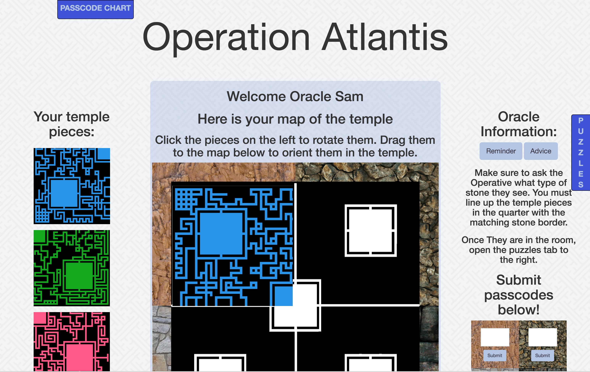
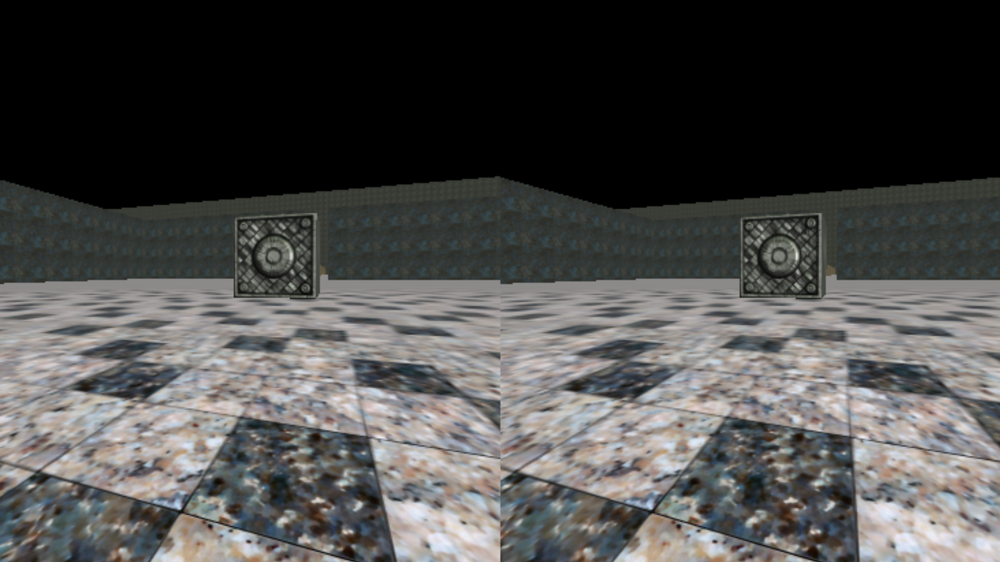
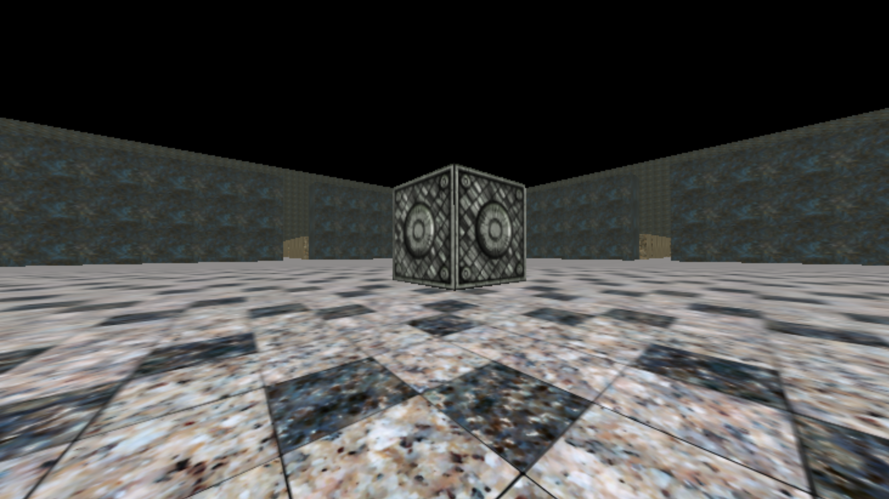
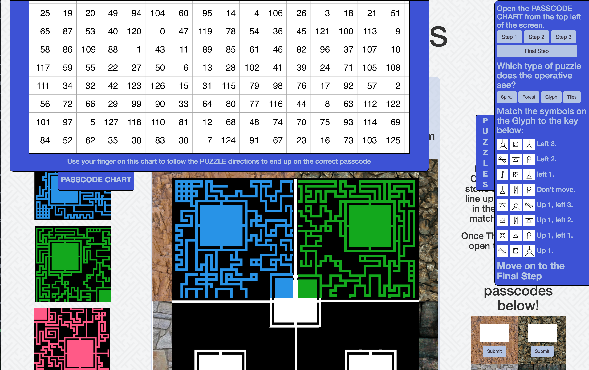
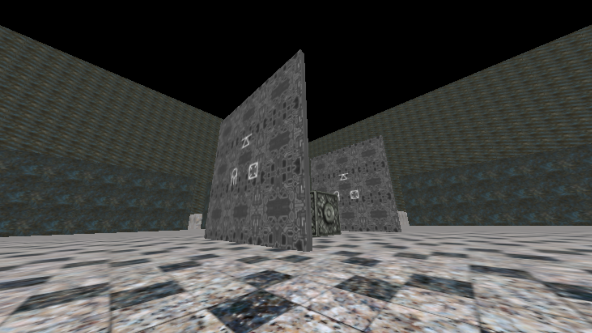
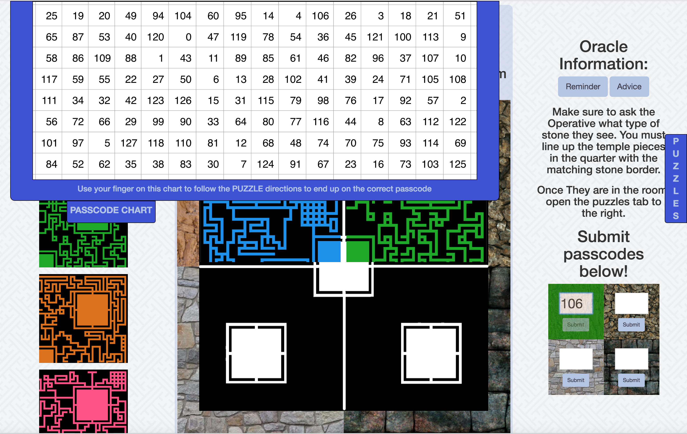

# Operation Atlantis
Operation Atlantis is an asymmetrical two player game in which one player plays using a computer, and the other plays on their smart phone.
The game was designed with Google cardboard in mind, but it can be played without.

The players must cooperate to attain four passcodes in a maze like temple. The player on the smartphone will navigate the temple, while the player on the computer guides them

The user on the computer sees this view:

The user on the smart phone sees this view:

Or this one if they don't have Google Cardboard

The player on the computer can manipulate four quarters of the temple to figure out where the other player is walking.
Once they guide them to the large room in the corner of each quarter, they must use the puzzle to figure out the passcode for the room.

Here is a puzzle example:

The computer player must then follow the instructions on the right and use the chart at the top to figure out each passcode. They then input in the bottom right;

Once they have completed all 4 puzzles, they win!
